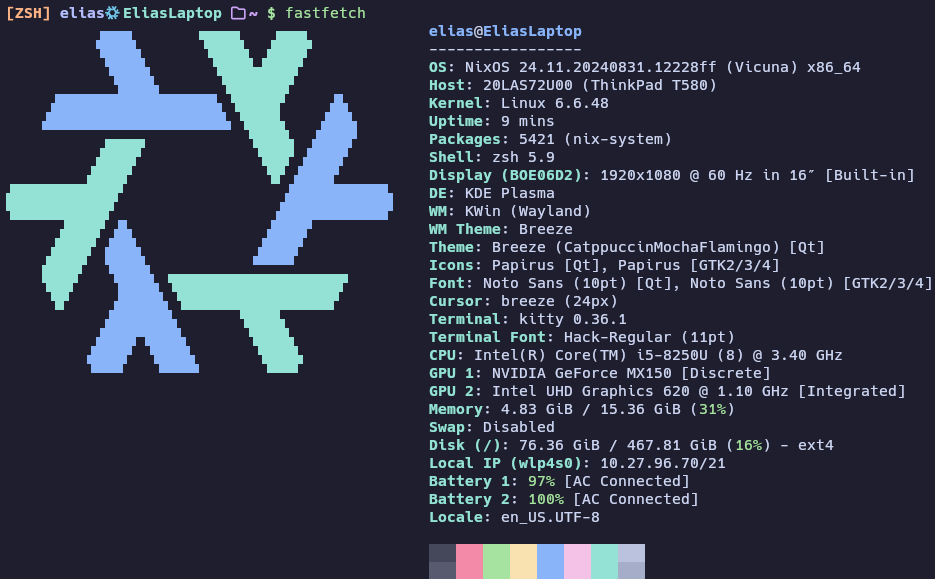

# NyxOS

My NixOS config

The name is inspired by the DOTA hero Nyx

## Overview

### Structure (Dendric Nix Pattern)

- [flake.nix](flake.nix) => Base of the configuration
- [hosts](hosts) => Per-host setup, disks and hardware-configuration.nix
- [modules](modules) => Flake Parts modules, the following modules are currently implemented:
  - System Modules:
    - flatpak
      - [apps.nix](/modules/apps.nix)
      - enable flatpak and add flathub repo
    - firefox
      - [browser.nix](/modules/browser.nix)
      - configure basic firefox
    - chromium-no-gpu
      - [browser.nix](/modules/browser.nix)
      - chromium with disabled gpu acceleration
    - languageEn
      - [desktop.nix](/modules/desktop.nix)
      - configure english (uk) language settings mixed with austrian locale settings
    - languageDe
      - [desktop.nix](/modules/desktop.nix)
      - configure german (austria) language settings
    - basicFonts
      - [desktop.nix](/modules/desktop.nix)
      - configure basic fonts
    - fonts
      - [desktop.nix](/modules/desktop.nix)
      - configure additional fonts
    - catppuccin
      - [desktop.nix](/modules/desktop.nix)
      - configure catppuccin theming
    - c
      - [dev.nix](/modules/dev.nix)
      - c and c++ development environment
    - python
      - [dev.nix](/modules/dev.nix)
      - python development environment
    - latex
      - [dev.nix](/modules/dev.nix)
      - latex development environment(some features need python)
    - dotnet
      - [dev.nix](/modules/dev.nix)
      - dotnet development environment
    - java
      - [dev.nix](/modules/dev.nix)
      - java development environment
    - android
      - [dev.nix](/modules/dev.nix)
      - android development environment(needs java)
    - go
      - [dev.nix](/modules/dev.nix)
      - go development environment
    - docker
      - [dev.nix](/modules/dev.nix)
      - enable and configure docker for development
    - devCerts
      - [dev.nix](/modules/dev.nix)
      - add development certificates to the system
    - vm
      - [dev.nix](/modules/dev.nix)
      - enable and configure virtual machine support for development
    - steam
      - [games.nix](/modules/games.nix)
      - configure steam and related tools
    - kde
      - [kde.nix](/modules/kde.nix)
      - setup kde settings
    - ssh
      - [network.nix](/modules/network.nix)
      - enable and configure ssh server and client
    - firewallDesktop
      - [network.nix](/modules/network.nix)
      - enable and configure firewall with basic settings
    - firewallServer
      - [network.nix](/modules/network.nix)
      - enable and configure firewall with server settings
    - vpn
      - [network.nix](/modules/network.nix)
      - enable and configure mullvad and wireguard vpn
    - blocky
      - [network.nix](/modules/network.nix)
      - enable and configure blocky adblocker
    - baseSettings
      - [nix.nix](/modules/nix.nix)
      - common nix and nixpkgs settings for all systems
    - distributedBuild
      - [nix.nix](/modules/nix.nix)
      - settings for building on remote machines
    - distributedBuilder
      - [nix.nix](/modules/nix.nix)
      - settings for providing building capabilities to other machines
    - nh
      - [nix.nix](/modules/nix.nix)
      - enable and configure nh
    - homeManager
      - [nix.nix](/modules/nix.nix)
      - enable home-manager service with basic settings
    - grub
      - [system.nix](/modules/system.nix)
      - configure grub bootloader
    - basicSystem
      - [system.nix](/modules/system.nix)
      - configure firmware updates, file system tools, and other basic utilities
    - optimizationsPC
      - [system.nix](/modules/system.nix)
      - configure optimizations for PC hardware
    - optimizationsLaptop
      - [system.nix](/modules/system.nix)
      - configure optimizations for laptop hardware
    - swap32
      - [system.nix](/modules/system.nix)
      - configure 32 GB swap
    - swap18
      - [system.nix](/modules/system.nix)
      - configure 18 GB swap
    - swap8
      - [system.nix](/modules/system.nix)
      - configure 8 GB swap
    - bluetooth
      - [system.nix](/modules/system.nix)
      - configure bluetooth settings
    - printing
      - [system.nix](/modules/system.nix)
      - configure printing services for the HP printer at home
    - sound
      - [system.nix](/modules/system.nix)
      - configure sound settings
    - cpuIntel
      - [system.nix](/modules/system.nix)
      - configure Intel CPU microcode updates
    - gpuNvidia
      - [system.nix](/modules/system.nix)
      - configure Nvidia GPU settings
    - gpuAmd
      - [system.nix](/modules/system.nix)
      - configure AMD GPU settings
    - nixIndex
      - [terminal.nix](/modules/terminal.nix)
      - configure nix-index
    - terminal
      - [terminal.nix](/modules/terminal.nix)
      - kitty + tmux(mouse mode because i am a filthy casual) + starship + direnv + fzf + eza + zsh
    - tv
      - [tv.nix](/modules/tv.nix)
      - dvb-s setup for tv
    - elias
      - [users.nix](/modules/users.nix)
      - user configuration for elias
    - others
      - [users.nix](/modules/users.nix)
      - user configuration for fred and gerhard
    - cliUtilities
      - [utilities.nix](/modules/utilities.nix)
      - add useful  tools
    - basics
      - [utilities.nix](/modules/utilities.nix)
      - basic packages needed for a functional system
    - autoUpdate
      - [utilities.nix](/modules/utilities.nix)
      - automatic system updates
  - Home Modules:
    - defaultApplicationsKde
      - [apps.nix](/modules/apps.nix)
      - set default applications for kde
    - libreoffice
      - [apps.nix](/modules/apps.nix)
      - configure libreoffice with basic settings
    - email
      - [apps.nix](/modules/apps.nix)
      - configure email clients
    - teams
      - [apps.nix](/modules/apps.nix)
      - configure microsoft teams client
    - pdf
      - [apps.nix](/modules/apps.nix)
      - configure pdf related tools
    - media
      - [apps.nix](/modules/apps.nix)
      - configure media players
    - discord
      - [apps.nix](/modules/apps.nix)
      - configure discord with vencord
    - kdeConnect
      - [apps.nix](/modules/apps.nix)
      - configure kdeconnect for home manager
    - vscode
      - [apps.nix](/modules/apps.nix)
      - configure vscode for home manager
    - qgis
      - [apps.nix](/modules/apps.nix)
      - configure qgis for home manager
    - betterfox
      - [browser.nix](/modules/browser.nix)
      - configure betterfox instead of firefox in home manager
    - catppuccin
      - [desktop.nix](/modules/desktop.nix)
      - configure catppuccin theming in home manager
    - minecraft
      - [games.nix](/modules/games.nix)
      - configure minecraft and related tools
    - plasma-manager
      - [kde.nix](/modules/kde.nix)
      - configure plasma manager
    - sailing
      - [network.nix](/modules/network.nix)
      - enable and configure sailing applications ;)
    - homeManager
      - [nix.nix](/modules/nix.nix)
      - enable home-manager service with basic settings
    - terminal
      - [terminal.nix](/modules/terminal.nix)
      - kitty + tmux(mouse mode because i am a filthy casual) + starship + direnv + fzf + eza + zsh
    - elias
      - [users.nix](/modules/users.nix)
      - home manager configuration for elias
    - fred
      - [users.nix](/modules/users.nix)
      - home manager configuration for fred
    - gerhard
      - [users.nix](/modules/users.nix)
      - home manager configuration for gerhard
    - git
      - [utilities.nix](/modules/utilities.nix)
      - configure git for home manager
    - guiUtilities
      - [utilities.nix](/modules/utilities.nix)
      - Usefull gui utilities
- [images](images) => Background and ReadMe images
- [workspaces](workspaces) => Workspaces for different tasks

### Fastfetch(Laptop)

### Background Image(1 of 14)

### Lockscreen Image(1 of 14)

