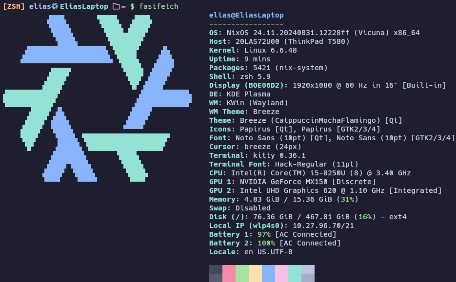

# NyxOS

My NixOS config

The name is inspired by the DOTA hero Nyx

## Overview

### Structure (Dendric Nix Pattern)

- [flake.nix](flake.nix) => Base of the configuration
- [modules](modules) => Flake Parts modules, the following modules are currently implemented:
  - System Modules:
    - **[apps.nix](/modules/apps.nix)**
      - flatpak
        - enable Flatpak and register the Flathub repository
    - **[browser.nix](/modules/browser.nix)**
      - chromium-no-gpu
        - install Chromium with Widevine DRM and GPU acceleration disabled
      - firefox
        - enable Firefox system-wide
    - **[desktop.nix](/modules/desktop.nix)**
      - base-desktop
        - enable polkit and D-Bus, required by all desktop environments
      - basic-catppuccin
        - apply Catppuccin Mocha/Peach theming system-wide without cursor theme
      - basic-fonts
        - install core fonts and Nerd Font variants of JetBrains Mono and Noto, with sane defaults
      - catppuccin
        - apply full Catppuccin Mocha/Peach theming system-wide including cursor theme
      - fonts
        - install the full Nerd Fonts collection (60+ families) plus core/Vista fonts
      - language-de
        - set German (Austria) language and locale for all LC categories
      - language-en
        - set English (GB) UI language with Austrian locale for measurements, currency, and time
    - **[dev.nix](/modules/dev.nix)**
      - android
        - install Android Studio, SDK platform-tools, and adb; adds elias to the adbusers group
      - c
        - install GCC, CMake, Make, GDB, Valgrind, GTest, Conan, and related C/C++ tooling
      - dev-certs
        - load all .pem certificates from the certs/ directory into the system trust store
      - dotnet
        - install .NET 10 SDK with ILSpy and set DOTNET_ROOT/DOTNET_BIN environment variables
      - go
        - install the Go toolchain with gopls, Delve debugger, and golangci-lint
      - java
        - install JDK 25 and JDK 8 with Ant, Maven, and Gradle; sets JAVA_25_HOME and JAVA_8_HOME
      - latex
        - install the full TeX Live scheme for LaTeX document authoring
      - python
        - install Python 3 with scientific and GUI libraries (numpy, matplotlib, pandas, pygobject, etc.)
    - **[games.nix](/modules/games.nix)**
      - steam
        - enable Steam with Proton, Protontricks, MangoHud, Gamescope, and open firewall ports
    - **[kde.nix](/modules/kde.nix)**
      - kde
        - enable KDE Plasma 6 on X11 with SDDM, Austrian keyboard layout, and trimmed default packages
    - **[network.nix](/modules/network.nix)**
      - blocky
        - run Blocky as a local DNS resolver with ad/malware blocking and custom LAN hostname mappings
      - cloudflared
        - run a Cloudflare Tunnel daemon for zero-trust remote access to local services
      - firewall-desktop
        - enable firewall with ports for SSH, Steam, Spotify, KDE Connect, and Stardew Valley LAN
      - firewall-server
        - enable firewall with minimal ports for SSH, HTTP/HTTPS, and DNS only
      - ssh
        - enable OpenSSH server (key-only auth) and configure client host aliases and known hosts
      - vpn
        - enable Mullvad VPN service and install WireGuard tools
      - warp
        - enable Cloudflare WARP client for secure DNS and network privacy
    - **[niri.nix](/modules/niri.nix)**
      - niri
        - enable the Niri tiling compositor with DankMaterialShell greeter, Thunar, and XWayland support
    - **[nix.nix](/modules/nix.nix)**
      - base-settings
        - enable flakes, allow unfree packages, configure the Nix daemon, and install Nix dev tools
      - distributed-build
        - configure this machine to offload builds to EliasPC via SSH
      - distributed-builder
        - configure this machine to accept remote build jobs from other hosts
      - home-manager
        - integrate Home Manager as a NixOS module with shared global packages
      - nh
        - enable nh with weekly auto-cleanup, keeping the last 3 generations for 7 days
    - **[optimizations.nix](/modules/optimizations.nix)**
      - optimizations-laptop
        - use the Zen kernel with TLP for AC/battery power profiles and an 80% charge threshold
      - optimizations-pc
        - use the Zen kernel, enable TLP in performance mode, and disable USB/PCIe power-saving for desktop use
    - **[system.nix](/modules/system.nix)**
      - basic-system
        - set timezone to Vienna, enable all firmware, fwupd, fstrim, and NTFS support
      - bluetooth
        - enable Bluetooth, power on at boot, and enable experimental features for battery reporting
      - cpu-intel
        - enable Intel CPU microcode updates and install PowerTOP
      - gpu-amd
        - enable AMDGPU driver with ROCm/OpenCL support, GPU frequency boosting, and 32-bit graphics
      - gpu-nvidia
        - enable NVIDIA proprietary drivers with modesetting and 32-bit graphics support
      - grub
        - configure GRUB EFI bootloader with a UEFI firmware entry
      - printing
        - enable CUPS with the HP HPLIP driver and SANE scanning support
      - sound
        - enable PipeWire with ALSA and PulseAudio compatibility, rtkit, and media control tools
      - swap
        - configure zram swap and an encrypted swapfile sized via the swapSize specialArg (in GB)
    - **[terminal.nix](/modules/terminal.nix)**
      - nix-index
        - enable nix-index-database with comma for running unlisted commands without installing them
      - terminal
        - enable ZSH system-wide and pull in the terminal Home Module for all users
    - **[users.nix](/modules/users.nix)**
      - elias
        - create the elias user with wheel, networkmanager, and printing group memberships
      - others
        - create the fred and gerhard users with standard group memberships
    - **[utilities.nix](/modules/utilities.nix)**
      - cli-utilities
        - install network, filesystem, hardware, and diagnostic CLI tools (fastfetch, jq, curl, etc.)
    - **[virtualization.nix](/modules/virtualization.nix)**
      - docker
        - enable Docker daemon with Google DNS and add all users in the users specialArg to the docker group
      - vm
        - enable VirtualBox with extension pack and guest additions for running virtual machines
      - winboat
        - enable QEMU/libvirt with SPICE USB redirection and virt-manager for Windows VMs
  - Home Modules:
    - **[ai.nix](/modules/ai.nix)**
      - opencode
        - enable the OpenCode AI coding agent with auto-update, Context7 MCP server, nix-module skill, and NixOS/Nix subagent with nix-check and nix-rebuild commands
      - opencode-dotnet
        - extend OpenCode with the dotnet-dev skill and dotnet build/test/format commands
      - opencode-java
        - extend OpenCode with the java-dev skill and Maven/Gradle build/test/format commands
    - **[apps.nix](/modules/apps.nix)**
      - discord
        - install Vesktop with Catppuccin Mocha CSS theme
      - email
        - install Thunderbird and register it as the default mail and calendar handler
      - idea
        - install JetBrains IntelliJ IDEA
      - kde-connect
        - install KDE Connect for phone-desktop integration
      - libreoffice
        - install LibreOffice Qt with English and German spell-check dictionaries
      - media
        - install VLC and cava, and configure Spicetify-themed Spotify with extensions
      - media-editors
        - install GIMP, Inkscape, and kdenlive for image and video editing
      - nomacs
        - install Nomacs image viewer and register it as the default for common image formats
      - obs
        - install OBS Studio with wlrobs and background-removal plugins
      - pdf
        - install Okular and pdfarranger for viewing and rearranging PDF files
      - qgis
        - install QGIS geographic information system
      - teams
        - install Teams for Linux
      - vscode
        - install VS Code (FHS wrapper) and set it as the default text editor
      - vscode-non-fhs
        - install VS Code (non-FHS) and set it as the default text editor
    - **[browser.nix](/modules/browser.nix)**
      - betterfox
        - configure Firefox with Betterfox hardened user.js and set it as the default browser
    - **[desktop.nix](/modules/desktop.nix)**
      - basic-catppuccin
        - apply Catppuccin Mocha/Peach theming in Home Manager without cursor theme
      - catppuccin
        - apply full Catppuccin Mocha/Peach theming in Home Manager including GTK, Qt, icons, and cursor
    - **[games.nix](/modules/games.nix)**
      - minecraft
        - install ATLauncher for managing Minecraft modpacks
    - **[kde.nix](/modules/kde.nix)**
      - plasma-manager
        - configure KWin, KRunner, screen locker, power settings, and session restore via plasma-manager
    - **[network.nix](/modules/network.nix)**
      - sailing
        - install sailing applications ;)
    - **[niri.nix](/modules/niri.nix)**
      - niri
        - configure Niri keybinds, layout, and the full DankMaterialShell bar with plugins and Danksearch
    - **[nix.nix](/modules/nix.nix)**
      - home-manager
        - enable Home Manager self-management with monthly auto-expiry of old generations
    - **[terminal.nix](/modules/terminal.nix)**
      - terminal
        - configure Kitty, ZSH with oh-my-zsh, Starship prompt, direnv, fzf, eza, ripgrep, and bat
    - **[users.nix](/modules/users.nix)**
      - elias
        - set home directory and username for the elias Home Manager configuration
      - fred
        - set home directory and username for the fred Home Manager configuration
      - gerhard
        - set home directory and username for the gerhard Home Manager configuration
    - **[utilities.nix](/modules/utilities.nix)**
      - git
        - configure Git with user identity, LFS, rebase-on-pull, and a log graph alias
      - gui-utilities
        - install Baobab disk analyser, Bruno API client, and GNOME multi-writer
- [modules/hosts](modules/hosts) => Per-host setup. Uses the defined modules
- [images](images) => Background and ReadMe images
- [workspaces](workspaces) => Workspaces for different tasks

### Fastfetch(Laptop)

### Background Image(1 of 14)

### Lockscreen Image(1 of 14)

