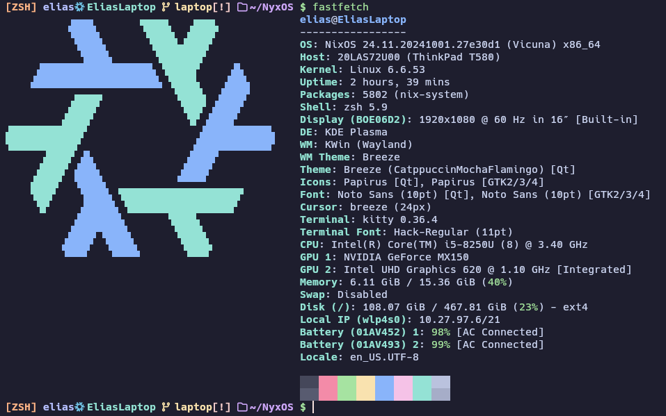
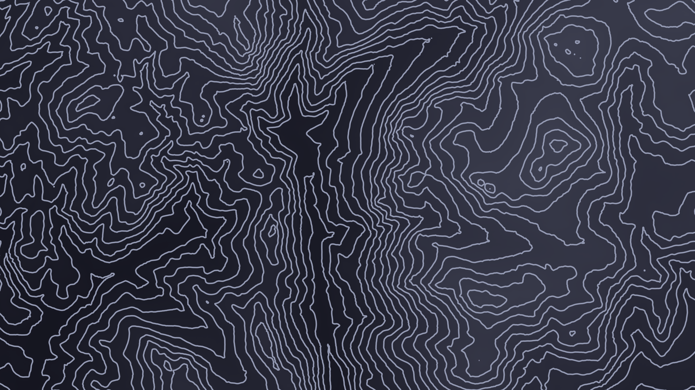

# NyxOS

My NixOS config

The name is inspired by the Dota hero Nyx

## Overview

### Layout

- [flake.nix](flake.nix) => Base of the configuration
- [hosts](hosts) => Per-host configurations that contain machine specific configurations
- [modules](modules) => Modularized NixOS system configurations
- [home](home) => Modularized NixOS user home configurations
- [images](images) => Background image and readme images
- [workspace](NyxOS.code-workspace) => Vscode settings in a base workspace

### Fastfetch(Laptop)

### Background Image

### Lockscreen Image

